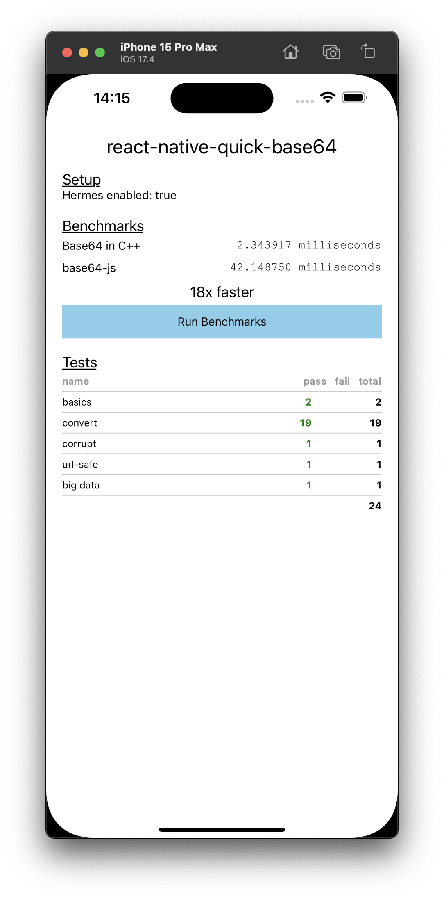
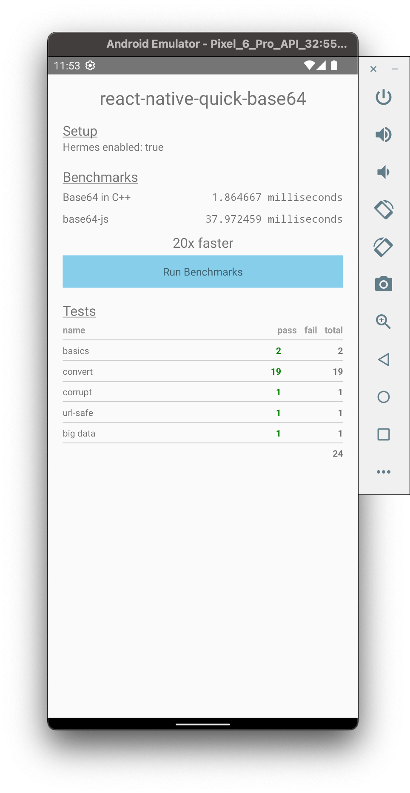

# react-native-quick-base64

A blazing fast, native Base64 implementation for React Native using C++ and JSI.

This library is ~16x faster than [base64-js](https://github.com/beatgammit/base64-js) on an iPhone 15 Pro Max simulator.
Try the benchmarks in the [example](./example) app.

| iPhone                                            | Android                                             |
| ------------------------------------------------- | --------------------------------------------------- |
|  |  |

---

## Features

- ⚡ Native C++/JSI implementation for maximum performance
- 🧠 Automatically installs its JSI bindings at runtime
- 🧩 Drop-in replacement for `base64-js` with matching API
- 🔒 No additional native setup or linking required

> ⚠️ **Breaking change** (#53):
> The `btoa`, `atob`, and `shim()` polyfills have been **removed**.
> Recent versions of **Hermes** provide `btoa` and `atob` natively in the JS runtime, so the polyfills are no longer needed.
> If you need string ⇄ base64 conversion, use `TextEncoder` / `TextDecoder` together with `fromByteArray` / `toByteArray` (see Usage below).

---

## Installation

```bash
npm install react-native-quick-base64
```

---

This module installs its native bindings automatically.
Simply importing the library is enough to activate the native backend.
Add it to your root entry point file or your first \_layout.tsx.

```js
import 'react-native-quick-base64' // triggers native JSI install to global namespace
```

You can also import individual helpers:

```tsx
import { fromByteArray, toByteArray } from 'react-native-quick-base64'
```

### Usage

```tsx
import { fromByteArray, toByteArray } from 'react-native-quick-base64'

const base64 = fromByteArray(new TextEncoder().encode('foo'))
const decoded = new TextDecoder().decode(toByteArray(base64))
```

---

## API

Compatible with [base64-js](https://github.com/beatgammit/base64-js).

### `byteLength(b64: string): number`

Returns the length of the byte array that corresponds to the base64 string.

### `toByteArray(b64: string, removeLinebreaks: boolean = false): Uint8Array`

Converts a base64 string into a Uint8Array.
If `removeLinebreaks` is `true`, all `\n` characters are removed first.

### `fromByteArray(uint8: Uint8Array, urlSafe: boolean = false): string`

Converts a byte array into a base64 string.
If `urlSafe` is `true`, the output uses a URL-safe base64 charset.

### `trimBase64Padding(str: string): string`

Removes trailing `=` or `.` padding from base64 or base64url-encoded strings.

---

## Contributing

See the [contributing guide](https://github.com/craftzdog/react-native-quick-base64/blob/main/CONTRIBUTING.md) to learn how to contribute to the repository and the development workflow.

---

## License

MIT © [Takuya Matsuyama](https://github.com/craftzdog)
